# SerendipyStudios
 
## Flyguins

  
  
### 1. Introducción

#### 1.1. Descripción breve del concepto

Flyguins es un juego de carreras en el que el jugador tendrá que completar el recorrido en el menor tiempo posible. Es un juego de carreras con scroll vertical, lleno de obstáculos y objetos, que podrán ser usados para obtener ventajas con respecto a las trampas.  

#### 1.2. Descripción breve de la historia

El jugador adopta el rol de uno de los pingüinos jugables, cada uno con su trasfondo y motivaciones, pero siendo todos ellos novatos en la Academia Pingüino. El objetivo común de todos ellos es mejorar como soldado, por lo que tendrán que pasar las duras pruebas que sus superiores le han puesto. Para ello, deberán recorrer los diferentes recorridos llenos de trampas al mismo tiempo que compiten con otros pingüinos de su promoción en completar todo en el menor tiempo posible para ser el mejor de todos. 

#### 1.3. Propósito, público objetivo y plataformas

Flyguins está pensado para jugar tanto solo como con amigos, ya que el jugador puede autoimponerse retos (pasarse todo en menos de un minuto, pasarse todo sin recibir daño por los obstáculos...), al mismo tiempo que puede intentar superar el tiempo record de sus amigos. El juego no busca atraer a los usuarios por una buena historia o acercamiento con los personajes, sino más bien por las mecánicas y la jugabilidad, puesto que al ser un juego dinámico en el que cada escenario es diferente y con varios caminos por donde pasar, cada partida puede resultar una experiencia diferente. 

El público objetivo al que se busca llegar es principalmente joven, entre 10 y 40 años, ya que son los que más tiempo libre suelen tener y mayor movimiento por las redes sociales, aunque alguien mayor podría jugarlos y disfrutarlo igual, puesto que las mecánicas son sencillas, y el estilo visual tan amable del juego invita a jugar a cualquier persona. 

En cuanto a las plataformas en la que el videojuego será lanzado, serán PC y Android, puesto que al ser un party game, de esta forma nos aseguramos de que todo el mundo puede jugarlo, ya que la persona media tiene de seguro un dispositivo móvil. 

### 2. Monetización y modelo de negocio

#### 2.1. Tipo de modelo de monetización

El juego será freemium, encontrándose dentro del juego algunas micro transacciones para obtener skins diferentes que de base el jugador medio no posee. También se podrá comprar un dlc en el que vengan más mapas. Se ha decidido este modelo de negocio para que el juego sea más accesible para todo el mundo, fomentando la divulgación del mismo. 

#### 2.2 Tablas de productos y precios
| Producto | Precio |
| ------------- | ------------- |
| Nuevas Skins temáticas (pack Halloween, pack Navidad, etc.)  | 1.99€/pack |
| DLC mapas | 0.99€/unidad |

### 3. Planificación y Costes

#### 3.1. El equipo humano

El equipo estará compuesto por los siguientes integrantes con sus respectivos roles: 
 

Julen Justo Neira: Compositor y Programador (aux). 

Javier Morales López: Director y Productor. 

Sergio López Serrano: Level Designer y Game Designer. 

Clara Bartolomé Pereira: Programadora y Artista 2D. 

David González Bella: Programador. 

Alexandra Izquierdo Esteban: Artista 2D, Animadora Community Manager 

#### 3.2. Estimación temporal del desarrollo

Dado que es un juego sin historia, el desarrollo se centrará en definir y pulir las mecánicas, al mismo tiempo que se diseña e implementa nuevo contenido (expansiones y packs que se lanzarán más adelante). 

Por lo tanto, estimamos que durará 2 meses. Dado que se plantea sacar nuevo contenido e ir actualizando el juego, se planea seguir con el desarrollo y mantenimiento del juego durante 2 años.

#### 3.3. Costes asociados

Se van a estimar costes de cara a tener un equipo trabajando durante dos años, siendo uno de esos años gratis de licencia, por ser alumnos (ya que el año que viene nos graduamos).

Cada programador cobrará 800€ mensuales, por lo que en total 19200€. 

El compositor cobrará 650€ al mes, por lo que en total 15600€ 

Cada artista cobrará 800€ al mes, por lo que en total 19200€ 

El level designer/game designer cobrará 800€ al mes, por lo que en total 19200€ 

El community manager ganará 750€ al mes, por lo que en total 18000€ 

El Director/productor ganará 800€ al mes, por lo que en total 19200€ 

Licencia de Clip Studio Paint Pro: 45€ 

Ableton Live Standard: 350€  

Webstorm: 129€

Adobe Animate: 290.28€

#### En total: 111214.28€ 

### 4. Mecánicas de Juego y Elementos de Juego (personajes (nº) y sus mecánicas, escenarios que hacen, número de assets que se necesitan para el escenario, módulos que se necesitan (esquinas, central, etcétera) 

#### 4.1. Descripción detallada del concepto de juego

El concepto de Flyguins se basa en completar un mapa en una carrera vertical contrarreloj, haciendo uso de los diferentes objetos que el jugador irá encontrando a lo largo del mapa, al mismo tiempo que esquiva diferentes obstáculos.

Al acabar la partida, el jugador podrá ver un ranking, y decidir jugar de nuevo (no necesariamente en el mismo mapa) o salir.

#### 4.2. Descripción detallada de las mecánicas de juego

Las mecánicas varían mínimamente en la versión que se lanzará para Android con respecto a la de PC. 

En la versión de PC, para poder impulsarse hacia arriba, el jugador verá una barra larga en la parte inferior de la pantalla, siendo esta recorrida por un marcador que se mueve horizontalmente a lo largo de toda la barra. El jugador deberá para ese marcador en una zona amarilla o verde (la verde impulsa al jugador con más potencia, pero es más difícil de parar el marcador en esa zona) para poder seguir avanzando, al mismo tiempo que se mueve horizontalmente. Si el jugador para el marcador en una zona roja no podrá avanzar hasta que tenga una nueva oportunidad para parar el marcador. Independientemente de la intensidad del salto, la cual es determinada por la barra previamente mencionada, la dirección dependerá de la tela pulsada por el jugador: ‘W’ para un salto completamente vertical, y ‘Q’ o ‘E’ para saltar en las diagonales izquierda o derecha, respectivamente. 

Al coger un objeto (distribuidos estos en posiciones específicas a lo largo de los mapas), este objeto aparecerá en la caja de objetos, situada en la parte superior de la pantalla. El objeto no se usará solo, puesto que será el jugador el que decida cuando usarlo. En el caso de que el jugador haya cogido un objeto, pero no lo haya usado y se encuentre con otro objeto nuevo, el objeto nuevo no sustituirá al viejo, será el que tenga de antes el que prevalezca. 

En la versión de Android se mantienen las mecánicas de movimiento horizontal, salvo que en lugar que realizar los saltos (en las diagonales o totalmente verticales), a falta de teclas, el usuario deberá presionar con el dedo en la zona de la pantalla correspondiente: la mitad de la pantalla para el salto vertical, y las zonas laterales para los saltos en diagonal. El uso de objetos también varía, pasando de pulsar una tecla en la versión de PC a pulsar en la caja del propio objeto en la versión de Android. 

#### 4.3. Controles

En la versión de PC, el jugador pulsará la tecla W para parar el marcador en una zona de la barra de abajo. Para moverse horizontalmente se usarán las teclas Q y E, que indican izquierda y derecha respectivamente. Para usar objetos se usa la tecla espacio. Al final el jugador solo usará las 3 primeras teclas, QWE, además de la barra espaciadora para hacer uso de todas las mecánicas del juego. 

En la versión para Android, todo es táctil, por lo que basta con pulsar el lateral de la pantalla para indicar la diagonal a la que el jugador quiera dirigirse, así mismo como pulsar el centro de la pantalla para propulsarse solo hacia arriba. Para hacer uso del objeto recogido, debe de pulsar en el slot en donde se guarde el objeto recogido. 

#### 4.4. Niveles y misiones

Al ser un juego basado en carreras contrarreloj llenas de obstáculos, no existen misiones como tal, el jugador solo deberá centrarse en ser lo más rápido y hábil que pueda. 

En cuanto a niveles, actualmente hay 3 niveles disponibles, siendo dichos niveles muy diferentes entre sí: en el nivel 1 el camino es más lineal, con solo una bifurcación, aunque bastante corta, puesto que el nivel está pensado para que el jugador se familiarice con los diferentes elementos del mapa. En el nivel 2 es donde predominan las bifurcaciones, siendo el recorrido por cada una de las mismas muy diferentes entre sí, por lo que cada partida será única al escoger diferentes caminos, estando todos ellos balanceados (es decir, si el jugador escoge el camino más largo, se encontrará menos obstáculos que si escoge el camino más corto). El nivel 3 es el que más juego da, ya que es el único en el que hay obstáculos animados, y, por tanto, la dificultad se ve incrementada, al mismo tiempo que el número de bifurcaciones disminuye, lo que hace de este nivel uno de los más difíciles a la hora de ir rápido, ya que será complicado avanzar si hay más obstáculos que bifurcaciones. 

También hay disponible un nivel tutorial, pensado para que los jugadores novatos se familiaricen con los controles y la mecánica del juego. Este tutorial contiene todos los obstáculos que el jugador se encontrará en los otros mapas, distribuidos de tal forma que no sea demasiado complicado superar. 

#### 4.5. Objetos, armas y power ups

Los objetos y power ups que podrá obtener el jugador al recoger un objeto (previamente no se sabe lo que coge hasta que lo coge) son los siguientes: 

- Escudo: Alrededor del pingüino del jugador aparecerá un escudo de hielo que este usará para superar un obstáculo sin necesitas de esquivarlo, pasando a través del mismo. Al ser un objeto que permite al jugador sobrepasar una gran cantidad de recorrido sin complicación, solo tiene la duración de 1 segundo desde que el jugador decide usarlo. 

- Velocidad: Al hacer uso de este objeto, toda la barra inferior de impulso se pone de color verde durante X impulsos, permitiendo al jugador moverse siempre a la velocidad máxima, hasta que consuma el número de impulsos permitidos.

#### 4.6. Arquitectura del software

Flyguins ha sido desarrollado utilizando ‘Phaser 3’, un framework que dota al lenguaje de javascript de una serie de herramientas muy convenientes para el desarrollo de videojuegos web, con el único requisito de que el navegador soporte canvas. 

Antes de entrar en los detalles del juego propiamente dicho, cabe destacar que, con el objetivo de eliminar los tiempos de carga in game al mínimo se ha creado una primera escena, ‘Preload’, en la cual se cargan todos los recursos, de modo que el jugador únicamente debe esperar una única vez: nada más ejecutar el juego (el estado de la carga se muestra mediante una intuitiva barra de progreso). 

 

Así pues, una vez aclarado este primer punto, cabe destacar que Flyguins, haciendo uso de las muchas facilidades que Phaser ofrece, sigue una organización basada en escenas, tal que cada pantalla (menú principal, tienda, pantalla de juego, ranking, etc) es, efectivamente, una escena con sus propios métodos ‘init’, ‘create’ y ‘update’ a su disposición. Con esta idea en mente, y pensando en concreto en los distintos niveles jugables que conforman el gameplay, se ha creado una clase genérica, ‘Gen_Level’, de la cual todos los niveles heredan, para así poder agrupar todas las funcionalidades comunes.  

 

En cuanto al propio jugador, se ha tratado de abstraer lo máximo posible las ‘componentes’ que forman a un personaje jugable. De este modo, se ha creado una clase 'Player’, en la cual se asigna tanto las físicas, como el sprite y las animaciones del mismo en base a una id, y, finalmente, se añade a la escena actual. Igualmente, de cara a los controles, un objeto de la clase ‘Player’ posee una instancia de la clase ‘Controls’ y ‘MovementBar’, de tal forma que sus mecánicas de movimiento quedan separadas de su faceta física y artística, logrando así una gran flexibilidad de cara a crear futuros personajes. 

 

Pasando a los mapas, estos han sido diseñados con el editor 2D ‘Tiled’, gracias al cual, partiendo de un tileset se pueden elaborar niveles en dos dimensiones separados por capas, y asignando a cada una de estas de los atributos que se deseen. Es gracias a esta última característica que se han implementado los niveles en el juego, ya que, una vez exportado este en formato JSON, se pueden filtrar las capas en base a un atributo en concreto. Por poner un ejemplo, mediante el atributo ‘collided’ se ha podido diferenciar la capa en la cual se hallan todos las paredes de las demás, y así establecer la colisión entre el jugador y esta. 

 

Finalmente, cabe destacar las interfaces gráficas, las cuales constan de numerosos botones, todos ellos colocados de la forma más consistente posible, tal que el jugador pueda encontrar siempre estos en el mismo lugar (como es el caso del botón de salir, el cual se halla situado siempre arriba a la derecha de la pantalla). Del mismo modo, cada botón de cada menú cambia su color al pasar el usuario el ratón por encima, ya que desde el equipo de desarrollo se cree que la retroalimentación es algo primordial para que el usuario sepa en todo momento que esperar del juego. 

### 5. Trasfondo

#### 5.1. Descripción detallada de la historia y la trama

La historia se desarrolla en la Academia Pingüino, institución encargada de entrenar a sus pingüinos para convertirlos en los mejores soldados. El jugador adoptará el rol de cada uno de los personajes jugables, teniendo que superar las duras pruebas que el sargento le pondrá en cada uno de los niveles. Los enemigos son soldados veteranos, encargados de fortalecer a los más novatos. 

#### 5.2. Personajes

##### 5.2.1. Personajes jugables

Si bien todos los pingüinos compiten entre ellos para mejorar como soldados en la Academia Pingüino, cada uno de ellos tiene una motivación, personalidad y trasfondo diferente: 

- Por un lado, tenemos a Steve: este joven pingüino ha tenido un sueño desde muy pequeño: ser el mejor pingüino volador de Pinguinea. Para conseguirlo, armado de determinación, se unió a la Academia Pingüino para lograr sus sueños. 

- Otro de nuestros protagonistas es Armin: devoró todos los libros que pudo sobre la historia de los pingüinos voladores y es un acérrimo fan del famoso general Jack. Después de reunir suficiente coraje para unirse a la academia, está decido a hacer realidad por sí mismo lo que ha estudiado en los libros de la aleta de su héroe. 

- Es siguiente en la lista es Bob: Bob tiene las cosas muy claras: no es muy listo, no es muy atlético, pero hay una cosa que desde luego es: cabezota, y cuando se le mete algo entre ceja y ceja no para hasta conseguirlo. Y lo único que tiene ahora entre las aletas este afable pero constante pingüino es ser el mejor volador de Pinguinea. 

- Y por último, pero no menos importante, está Karta: el fuerte de Karta no es hacer amigos pero sí lo es entrenar hasta quedarse sin aliento. Es una loca de la velocidad y hará honor a ello siendo la pingüino más rápida de la academia. 

##### 5.2.2. Personajes no jugables

- Este es el Sargento Jack, el superior del jugador, que le ayudará en el nivel tutorial, explicándole los controles y los objetivos. 

- Esta es Kurta, la hermana gemela de Karta. A diferencia de su hermana, no le interesa ascender como soldado, sino vender su mercancía, por lo que es la encargada de la tienda de los DLCs.

- Por otro lado, están los Pingus, crías de pingüino que desean crecer y algún día poder alistarse en la Academia Pingüino.

#### 5.3. Entornos y lugares

Actualmente, Flyguins cuenta con 4 niveles, siendo uno de ellos el tutorial. Cada nivel se caracteriza por su forma, siendo el nombre de cada uno una pista que indica al jugador lo que se va a encontrar. Tenemos:

- Diagonales Dolorosas:

- Simetría Sinuosa:

- Trayecto Torturoso:

- Tutorial:

A parte de estos mapas, hay otros dos mapas diseñados que serán lanzados como DLCs. Estos son:

- Paraiso Pincho

- Sierras Salvajes

### 6. Arte

#### 6.1. Estética general del juego

La estética general el juego es una muy amable y family friendly, pensada para atraer a un espectro grande de público.  Se ha optado por un estilo sencillo, puesto que al ser un juego de carreras contrarreloj, no se busca sobrecargar al jugador con demasiados elementos en pantalla o diseños muy elaborados; el objetivo es que se entienda todo lo que pasa en pantalla en todo momento, por lo que el juego se ha desarrollado con una estética simple y homogénea. 

En cuanto al concepto general, el juego se desarrolla en la Academia Pingüino, por lo que van a abundar los colores fríos, estando presentes en todos momentos aquellos elementos como pueden ser hielo o nieve. Cada nivel se desarrolla en un lugar diferente (en la propia academia, en una cueva...), pero todos ellos comparten una característica: es una zona helada. 

#### 6.2. Apartado visual

Como bien se ha indicado en el apartado anterior, el juego cuenta con una estética simple y homogénea. El estilo de dibujo es uno muy limpio, compuesto mayoritariamente por líneas no demasiado gruesas, y un sombreado plano. De esta forma, el jugador no se sentirá agobiado por el diseño, y podrá distinguir de una forma muy sencilla qué está ocurriendo en la pantalla, identificando y reconociendo cada uno de los elementos. 

También se ha usado la siguiente paleta de colores para todos los mapas:

#### 6.3. Concept Art
- Fondos:

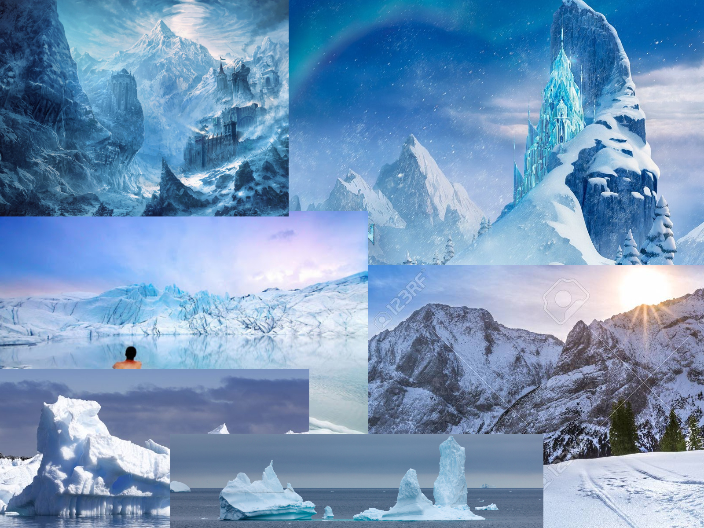
Referencias para el paisaje de las pantallas 

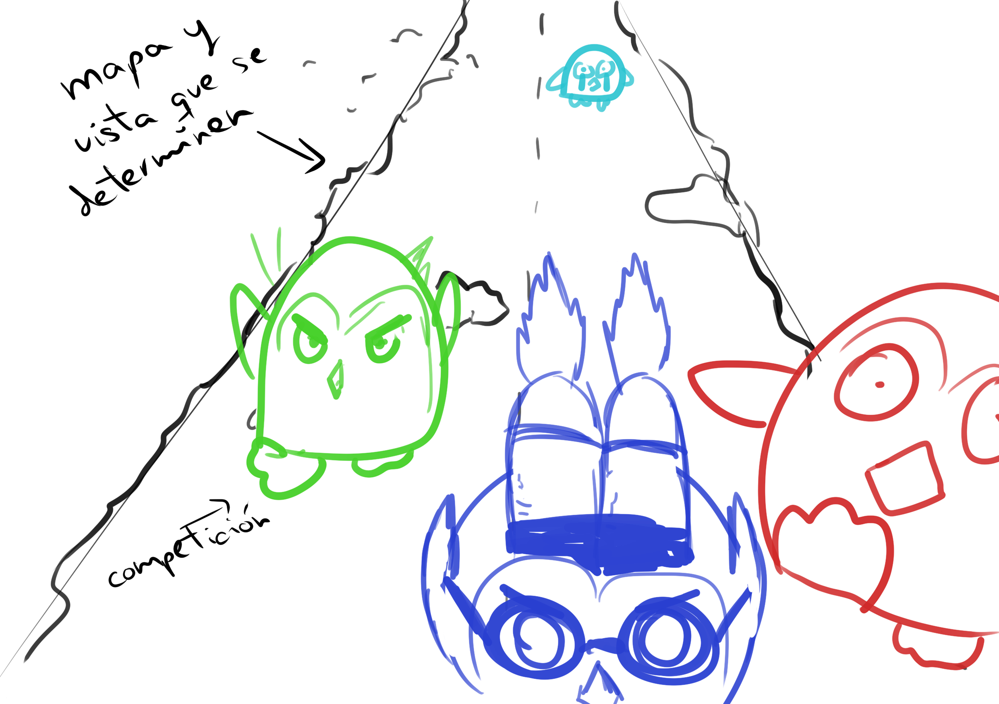
Boceto para el menú principal/cover 

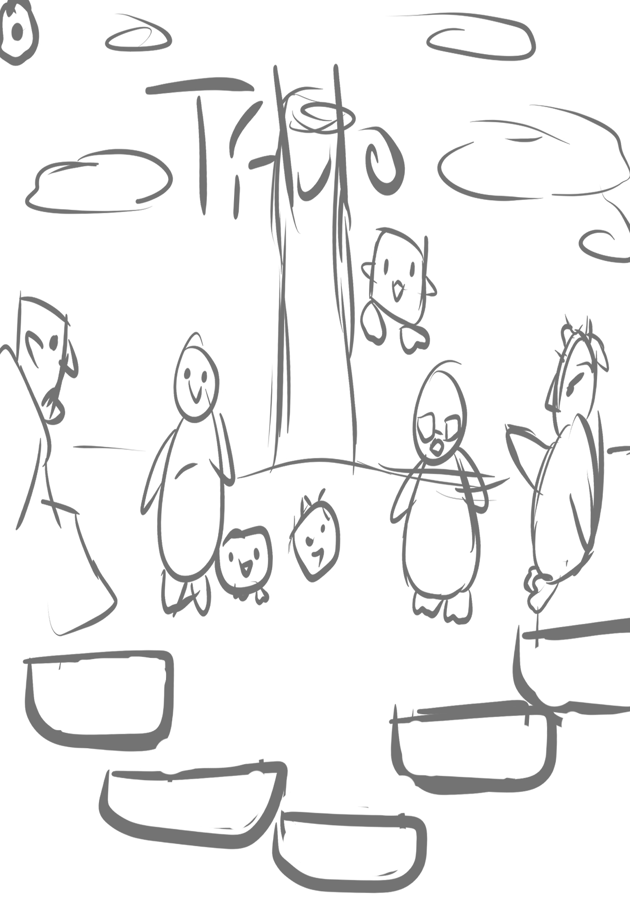
Boceto para el menú principal/cover

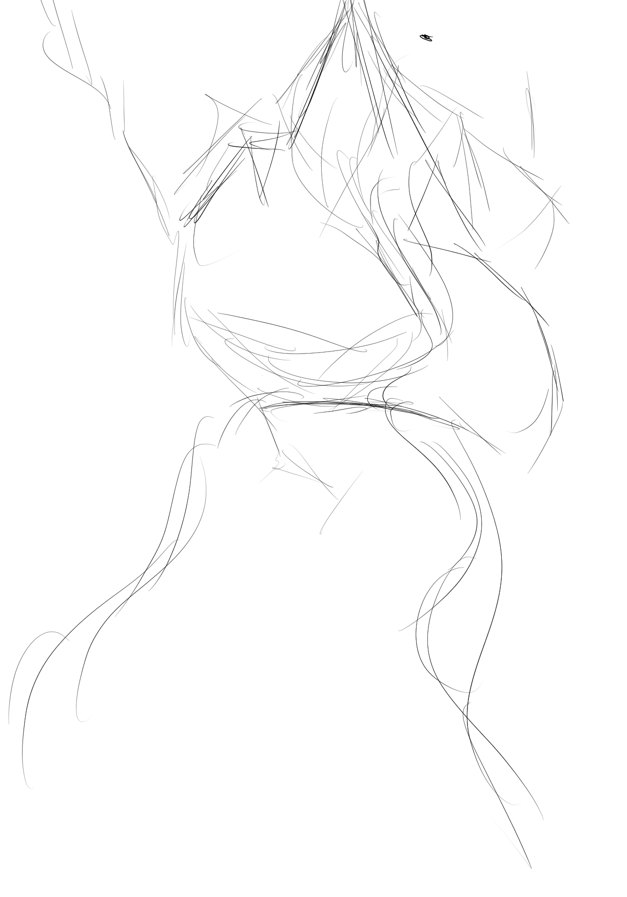
Boceto para el menú principal/cover

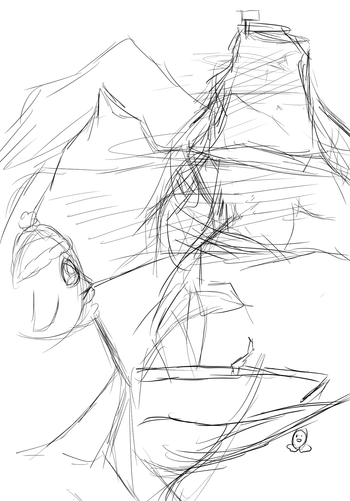
Boceto para el menú principal/cover 

Cover/Menú Principal/Créditos

Fondo base 

Fondo para el navegador

- Personajes:

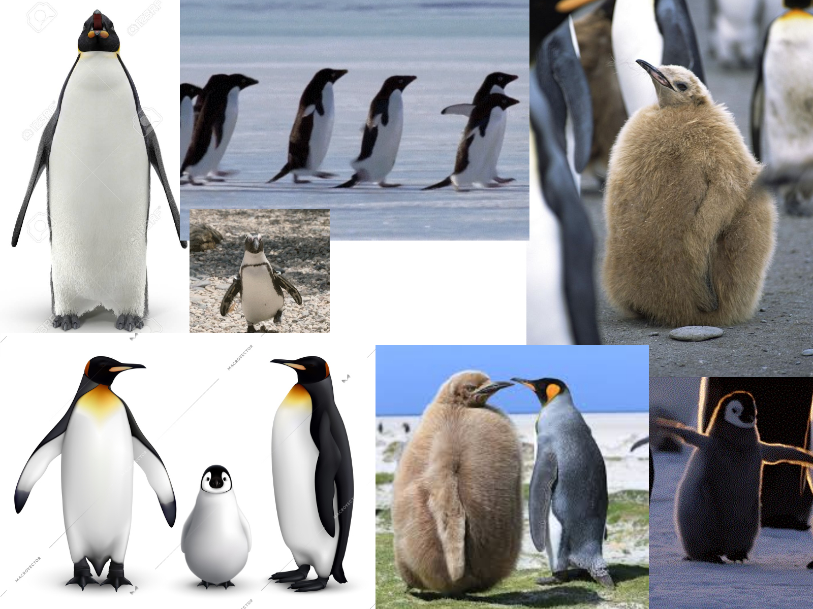
Referencias de pingüinos 

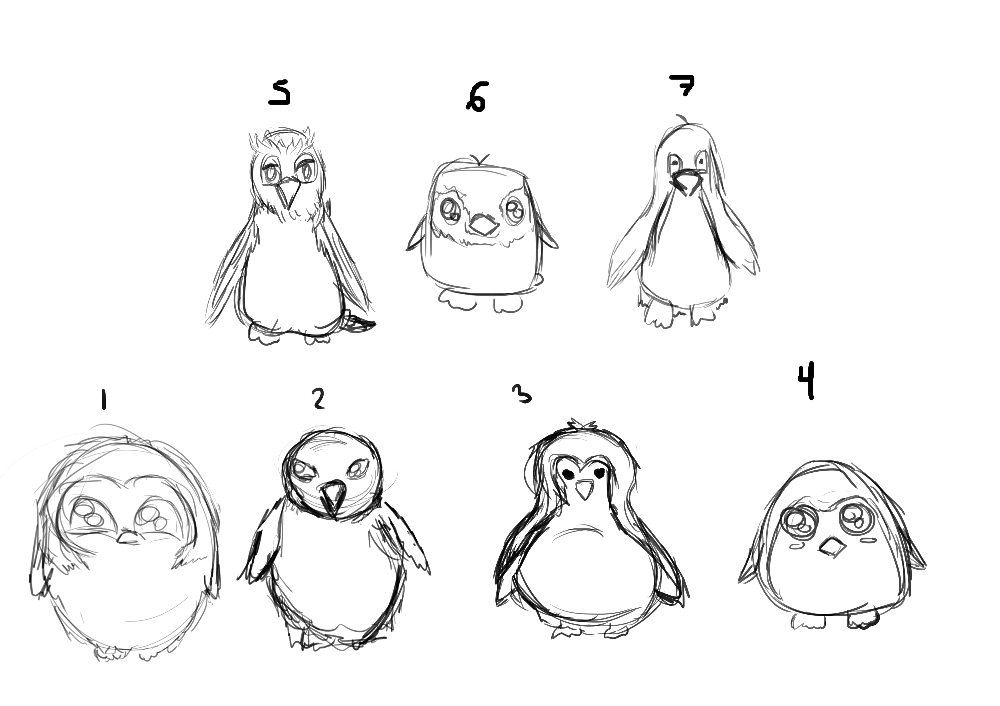
Bocetos iniciales de pingüinos 

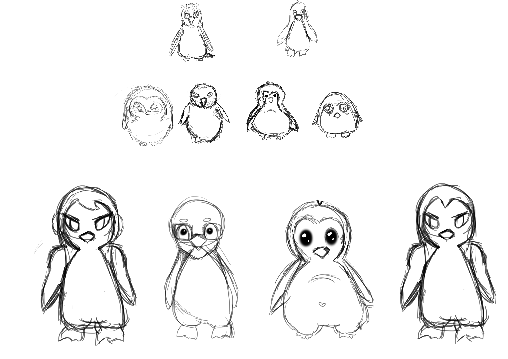
Segundos bocetos de pingüinos 

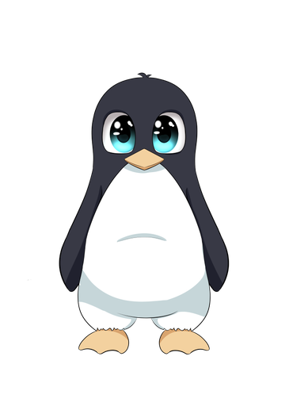
Concept para Steve 

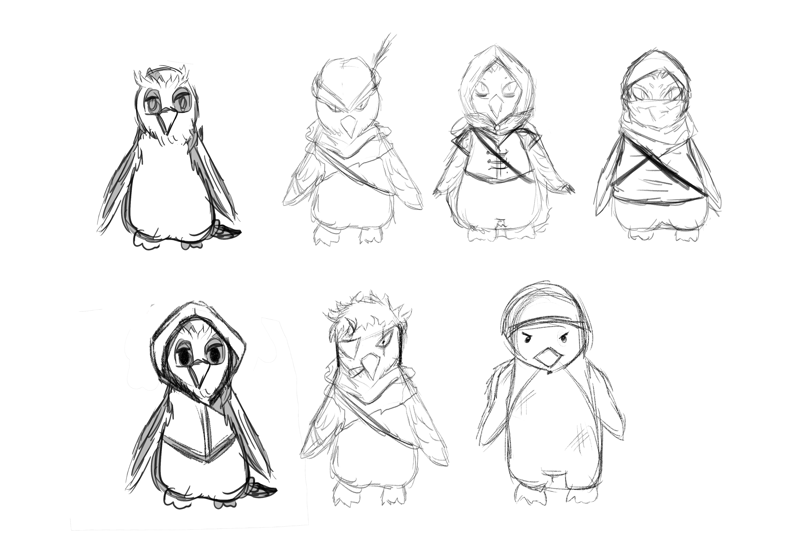
Bocetos para el sargento 

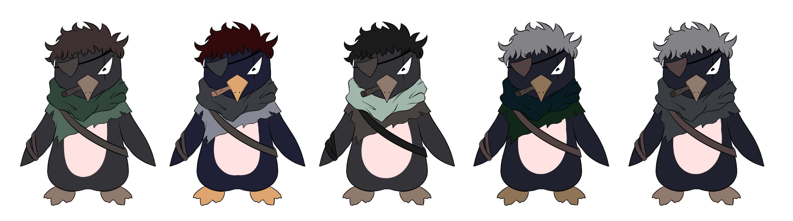
Estudio de color para el Sargento Jack 

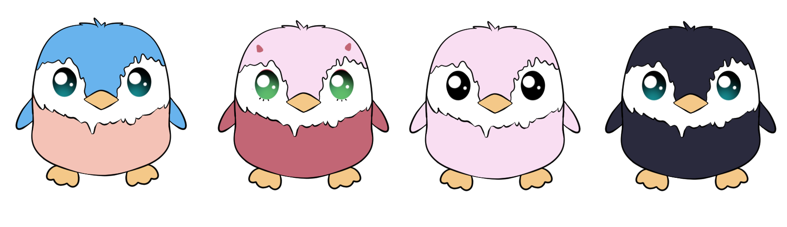
Estudio de color para Pingu 

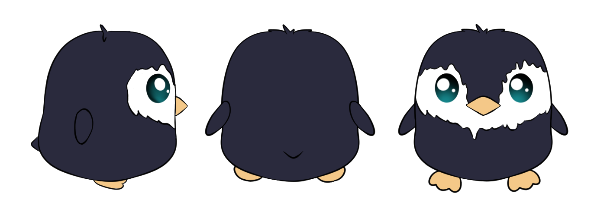
Turnaround de Pingu

Steve

Armin

Bob

Karta

Sargento Jack

Kurta

Pingu

Peluches de los personajes para el Lobby:

Armin

Bob

Kurta

Steve

- Power Ups:

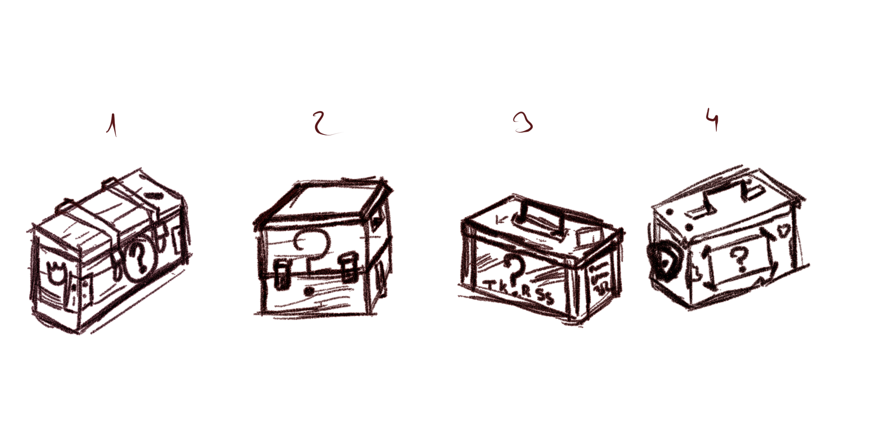
Primeros bocetos de las cajas de los power ups 

Estudio de colores para las cajas de power ups:

Caja Marrón

Caja Verde

Caja Morada

Caja Verde vista frontal

Caja brillando

Escudo

Escudo Brillando

Velocidad

Estudio de colores para el power up de velocidad

- Eventos

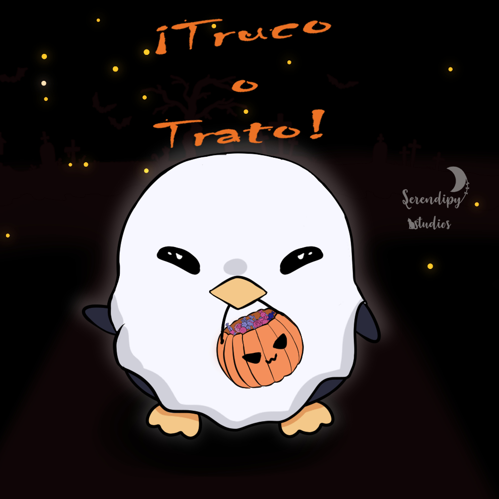
Evento Halloween 
- Fondos
- Pantallas

Ajustes

Creditos

Lobby

Menú Principal

Modo de Juego

Nivel jugable

Ranking

Menú de Salir

Pantallas de Tutorial

- Tilesheet de mapas:

- Obstáculos:

    

Pinchos

  

Sierras

- Packs

Pack de verano

Pack de navidad

### 7. Animación 

En el juego solo existe animaciones por parte de los personajes jugables y algunas trampas que el jugador se encontrará a lo largo del mapa. Para futuras actualizaciones, habrá enemigos que disparen o se avalancen sobre el jugador, así como más power ups y trampas animadas. 

#### 7.1. Personajes 

Armin

Bob

Karta

Steve

Pingu

#### 7.2. Objetos 

Caja

Dash

Cuchillas

### 8. Sonido 

Tanto la música como los efectos de sonido de Flyguins está pensada para crear un ambiente animado y caótico, dando así al jugador la sensación de que todo está en caos en todo momento. Todos estos assets de sonido son de un sitio web externo de libre uso, aunque algunos han sido modificados. En el punto 8.3. se mostrará el link de la funte externa de dichos assets.

#### 8.1. Sonido ambiente y música 

Habrá dos pistas de música en el juego: la de las pantallas del menú, créditos, controles... y la del propio juego en sí, es decir, una vez se encuentre el jugador en uno de los niveles. Para todos los niveles habrá la misma pista de audio, puesto que el fuerte del juego no es la variadad de música que puede llegar a haber, sino el gameplay, por lo que se ha centrado todo en tener una sola pista que haga que el jugador se sumerja en la dimanicidad de la acción de los niveles.

#### 8.2. Efectos sonoros 

Los efectos de sonido, a diferencia de la música de fondo, son más minimalistas y simples, puesto que, al haber tantos efectos de sonido (calisiones con las paredes, suelo, con objetos, el aleteo...), podría ser estresante para el jugador escuchar efectos muy elaborados. También tendrán un volumen más bajo que la música de fondo, para que el jugador no se canse de escucharlo (por ejemplo, el pingüino estará aleteando constantemente, por lo que se ha escogido un sonido sencillo y simplista para no molestar al usuario).

#### 8.3. Lista de sonidos 

Si bien la mayoría de efectos musicales han sido modificados, todos han sido extraidos de una página de uso libre o de vídeos que los ofrecían para uso libre (FreeSound y YouTube, concretamente). Por lo tanto, en cada sonido se indicará el link del cual procede el sonido originalmente.

- Efecto de aleteo: https://www.youtube.com/watch?v=YYpNloXxowY 
- Efecto de click en cualquier botón: https://freesound.org/people/timbreknight/sounds/342546/
- Efecto de coger una caja: https://freesound.org/people/lartti/sounds/527580/
- Efecto de colisión con las paredes: https://freesound.org/people/newagesoup/sounds/348244/
- Efecto de colison con los obstáculos: https://www.youtube.com/watch?v=MoliqYxwdTU
- Efecto de sonido del escudo: https://www.youtube.com/watch?v=eUxq1f99zcE
- Efecto de sonido de la velocidad: https://www.youtube.com/watch?v=YYpNloXxowY 

- Música del menú: https://freesound.org/people/v0idation/sounds/115144/
- Música de la pantalla de jugar: https://freesound.org/people/Timbre/sounds/151171/

### 9. Interfaz 

La interfaz de juego es sencilla, intentando ocupar lo menos posible, teniendo en cuenta que el usuario necesitará ver lo máximo que pueda, ya que tiene que tener en cuenta varios elementos del juego en todo momento. La disposición de los distintos elementos de la interfaz es la siguiente:

En la parte inferior de la pantalla aparecerá una barra horizontal que indica la intensidad con la que el pringüino se propulsará, y una barra vertical más pequeña recorrido la barra horizontal. Estas dos barras serán las que determinen la intensidad con la que se propulsará el pingüino. En la parte izquierda, se encuentra una barra vertical que indica el progreso del pingüino a lo largo de todo el mapa. En la parte superior, encontramos dos elementos: en la esquina izquierda, está el hueco en el que se almacenará el objeto que coja el pingüino, listo para consumir. En la esquina derecha, está el botón de salir.

#### 9.1. Diseños básicos de los menús 

Todos los menús tienen una estética de lugar helado, por lo que todos los botones son trozos de hielo. El menú de la tienda está a cargo de Kurta, hermana de Karta, por lo que se refuerza más el hecho de que sea una tienda. En el menú de cómo jugar, Jack estará a cargo de enseñar a los jugadores los controles básicos y los distintos elementos, por lo que el jugador podrá sentir que alguien veterano le está enseñando a jugar.

 
### 10. Fecha de lanzamiento
La fecha de lanzamiento del juego será el 19/11/2020, aunque se lanzarán más DLCs a lo largo del tiempo.
